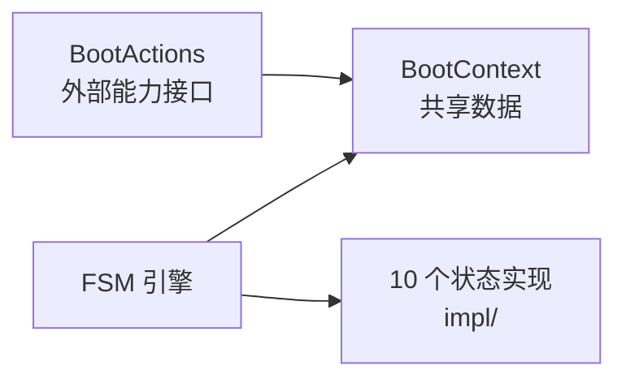
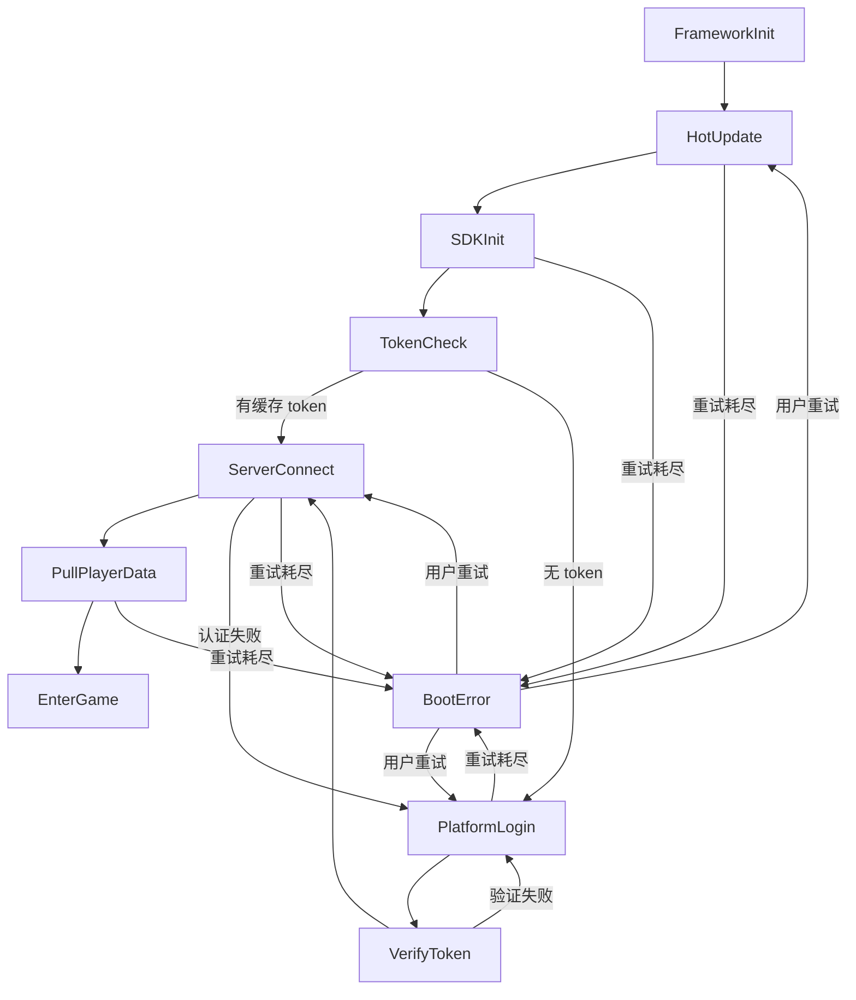

## 背景

游戏启动从来不是一条直线。它要经历框架初始化、热更新、SDK 初始化、平台登录、token 验证、服务器连接、玩家数据拉取——每一步都可能失败，每一步都可能需要重试，某些失败还得跳回前面的步骤。

如果把这套流程写在一个大 `async` 函数里，你会得到什么？一堆 `try/catch`、分散的重试计数、隐式的跳转逻辑，以及一个没人敢改的 `startup()` 函数。

我们在 Cocos Creator 3.8 项目中用 PureMVC 架构，把启动流程建模为一个**有限状态机（FSM）**。每个启动步骤是一个独立的状态类，状态之间的转换构成一张显式图。

## 整体架构

boot 模块的目录结构：

```text
assets/core/boot/
├── BootFSM.ts              # 状态机构造，注册所有状态
├── BootContext.ts           # 共享上下文（数据载体）
├── base/
│   └── BootActions.ts      # 外部能力接口（DI 注入点）
├── defines/
│   ├── boot.enum.ts        # 启动状态枚举
│   └── boot.structs.d.ts   # 类型声明
├── impl/                   # 各状态实现
│   ├── FrameworkInitState.ts
│   ├── HotUpdateState.ts
│   ├── SDKInitState.ts
│   ├── TokenCheckState.ts
│   ├── PlatformLoginState.ts
│   ├── VerifyTokenState.ts
│   ├── ServerConnectState.ts
│   ├── PullPlayerDataState.ts
│   ├── EnterGameState.ts
│   └── BootErrorState.ts
└── index.ts                # barrel 导出
```

三个核心角色：



- **FSM** (`assets/core/utils/fsm/FSM.ts`)：泛型状态机引擎，负责状态注册、转换触发、历史记录
- **BootContext**：启动过程的共享数据载体（token、重试计数、错误信息等）
- **BootActions**：外部依赖的抽象接口，通过构造函数注入

启动流程的状态转换图：



这张图本身就是启动流程的完整文档——比任何注释都准确。

## 核心设计

### 1. 通用 FSM 引擎：泛型参数化，零业务耦合

FSM 基类通过三个泛型参数（状态类型、事件类型、上下文类型）与业务完全解耦：

```typescript
// utils/fsm/FSM.ts
export class FSM<TState, TEvent, TContext> {
    private currentState: IState<TState, TEvent, TContext> = null;
    private states: Map<TState, IState<TState, TEvent, TContext>> = new Map();
    private history: StateTransitionRecord<TState, TEvent>[] = [];

    public transitionTo(targetState: TState, event: TEvent): boolean {
        const target = this.states.get(targetState);
        if (!target) return false;

        this.currentState.onExit?.(this.context, targetState);
        const prevState = this.currentState.name;
        target.onEnter?.(this.context, prevState);
        this.currentState = target;

        this.recordTransition(prevState, targetState, event);
        this.notifyTransitionListeners(prevState, targetState, event);
        return true;
    }
}
```

每个状态只需实现 `IState` 接口：

```typescript
// utils/fsm/IState.ts
export interface IState<TState, TEvent, TContexts> {
    name: TState;
    onEnter?(contexts: TContexts, prevState: TState): void;
    onExit?(contexts: TContexts, nextState: TState): void;
    handleEvent?(event: TEvent, contexts: TContexts): TState | null;
    update?(contexts: TContexts, dt: number): void;
}
```

`BootFSM` 只需指定泛型参数并注册所有状态：

```typescript
// boot/BootFSM.ts
export class BootFSM extends FSM<BootState, void, BootContext> {
    constructor(ctx: BootContext) {
        super({ initialState: BootState.FrameworkInit }, ctx);
        ctx.fsm = this;

        this.registerStates([
            new FrameworkInitState(),
            new HotUpdateState(),
            new SDKInitState(),
            // ... 其余 7 个状态
        ]);
    }
}
```

这套 FSM 引擎也用于 UI 栈管理、网络连接管理等其他模块，是框架级的复用基础设施。

### 2. BootContext：把隐式状态变成显式数据

启动流程中需要在步骤间传递的数据全部收敛到 `BootContext` 中：

```typescript
// boot/BootContext.ts
export class BootContext {
    fsm!: FSM<BootState, void, BootContext>;
    readonly actions: BootActions;

    sdkLoginResult?: unknown;
    cachedToken?: string;
    serverToken?: string;

    retryCount: Map<string, number> = new Map();
    maxRetry = 3;

    lastError?: BootErrorInfo;
    lastFailedState?: BootState;

    incrementRetry(state: string): boolean {
        const count = (this.retryCount.get(state) ?? 0) + 1;
        this.retryCount.set(state, count);
        return count <= this.maxRetry;
    }
}
```

关键设计决策：
- **重试按状态隔离**：`retryCount` 是 `Map<string, number>`，每个步骤独立计数，互不干扰
- **记录失败来源**：`lastFailedState` 让 `BootErrorState` 知道用户点"重试"后应该跳回哪个状态
- **只存数据，不做决策**：Context 不触发任何副作用，保持纯数据角色

### 3. 异步状态的统一模式：事件驱动 + 对称清理

大部分启动步骤是异步的（等待事件回调）。每个异步状态遵循相同模式：

```typescript
// impl/HotUpdateState.ts
export class HotUpdateState implements IState<BootState, void, BootContext> {
    readonly name = BootState.HotUpdate;
    private _ctx!: BootContext;

    onEnter(ctx: BootContext): void {
        this._ctx = ctx;
        M.event.once(CoreEvents.HOT_UPDATE_READY, this.onReady, this);
        M.event.once(CoreEvents.HOT_UPDATE_FAILED, this.onFailed, this);
        M.hotupdate.checkUpdate();
    }

    onExit(): void {
        M.event.off(CoreEvents.HOT_UPDATE_READY, this.onReady, this);
        M.event.off(CoreEvents.HOT_UPDATE_FAILED, this.onFailed, this);
        this._ctx = null!;
    }

    private onReady = (): void => {
        this._ctx.fsm.transitionTo(BootState.SDKInit, undefined!);
    };

    private onFailed = (data: { error: string }): void => {
        if (this._ctx.incrementRetry(BootState.HotUpdate)) {
            this._ctx.fsm.transitionTo(BootState.HotUpdate, undefined!);
        } else {
            this._ctx.lastFailedState = BootState.HotUpdate;
            this._ctx.lastError = { code: 'HOT_UPDATE_FAILED', msg: data.error };
            this._ctx.fsm.transitionTo(BootState.BootError, undefined!);
        }
    };
}
```

这个模式有三层保障：

1. **事件驱动而非 Promise**：Cocos Creator 中许多 SDK 回调不走 Promise（如平台登录）。用全局事件总线 `M.event` 解耦，状态只关心事件名，不关心谁发出
2. **`onExit` 保证清理**：FSM 在 `transitionTo` 时**先调用旧状态的 `onExit`，再调用新状态的 `onEnter`**，事件监听不会残留
3. **重试逻辑内聚**：每个状态自己决定重试策略——大多数是"最多 3 次然后跳到 `BootError`"

### 4. 条件分支显式化：TokenCheck 的免登录路径

用户上次登录后缓存了 token。下次启动时跳过登录界面直接连服务器。在传统代码中这往往是 `if/else` 嵌套在大函数里。在状态机模型中，它是一个独立状态：

```typescript
// impl/TokenCheckState.ts
export class TokenCheckState implements IState<BootState, void, BootContext> {
    readonly name = BootState.TokenCheck;

    onEnter(ctx: BootContext): void {
        const token = ctx.actions.getCachedToken();
        if (token) {
            ctx.cachedToken = token;
            ctx.fsm.transitionTo(BootState.ServerConnect, undefined!);
        } else {
            ctx.fsm.transitionTo(BootState.PlatformLogin, undefined!);
        }
    }
}
```

13 行代码，没有 IO，没有事件监听，不需要 `onExit`。但它明确表达了"启动流程中存在一个分支决策点"——这是文档，也是代码。

### 5. 登录失败处理中的"取消"语义

`PlatformLoginState` 展示了一个细腻的处理——用户主动关闭登录界面不应算作失败，只需要重新绑定事件监听等待用户再次打开：

```typescript
// impl/PlatformLoginState.ts — 关键片段
private onLoginFailed = (data: { error: string; canceled?: boolean }): void => {
    if (data.canceled) {
        this.bindListeners();   // 不增加重试计数，只重新绑定
        return;
    }
    if (this._ctx.incrementRetry(BootState.PlatformLogin)) {
        this._ctx.fsm.transitionTo(BootState.PlatformLogin, undefined!);
    } else {
        // 重试耗尽，进入错误状态
    }
};
```

这种"用户取消不算失败"的逻辑如果写在一个大函数里，很容易被忽略或误处理。

### 6. 依赖注入：BootActions 接口

启动流程需要的所有外部能力都定义在 `BootActions` 接口中：

```typescript
// base/BootActions.ts
export interface BootActions {
    startupFramework(): void;
    openLoginUI(): void;
    openErrorUI(data: { error: BootErrorInfo; onRetry: () => void }): void;
    openStartupGameUI(): void;
    getCachedToken(): string | null;
    clearCachedToken(): void;
    verifyToken(credential: unknown): void;
    pullPlayerData(): void;
}
```

core 层不关心这些能力由谁实现。业务层实现此接口后注入 `BootFSM`。这也意味着可以 mock 整个 `BootActions` 来单独测试状态机逻辑。

## 设计取舍

**为什么不用 async/await？**

如果能写 `await startFramework(); await checkHotUpdate(); ...`，代码会更紧凑。但在游戏引擎环境中：

- SDK 回调不一定返回 Promise，强行 `promisify` 会丢失取消能力
- 重试逻辑在 async/await 中需要手动包装 `retry()` 工具函数
- 单步测试困难——你只能测整个 `async startup()` 函数
- 状态机让每个步骤成为独立可测试单元：传入 Context，验证是否进入了正确的下一个状态

**为什么把 Context 和 Actions 分离？**

Context 是纯数据容器，Actions 是副作用集合。数据流转和副作用触发是两个正交关注点。Context 可被序列化、快照；Actions 是唯一需要 mock 的层。

**代价**：11 个文件，每个状态一个，看起来比一个函数多。但其中 7 个异步状态遵循完全相同的模式，新增一个步骤就是复制粘贴改三处（事件名、成功/失败目标状态），不会引入 bug。

## 总结

用 FSM 管理游戏启动流程的核心价值：

- **显式状态图**：启动流程的完整路径（包括错误和回退）在一张图中可见，新人不需要从代码中反推
- **每步可独立测试**：构造 `BootContext`，调用 `onEnter`，断言 `transitionTo` 的目标状态
- **新增步骤零风险**：加一个新状态类 + 注册到 `BootFSM`，不触碰现有逻辑
- **引擎可复用**：FSM 基类是泛型的，也用于 UI 栈、网络状态机等其他模块

如果你面对类似的复杂启动流程——多异步步骤、可失败、可重试、有回退路径——不妨考虑显式建模为状态机，而不是塞进一个大 `async` 函数里。
