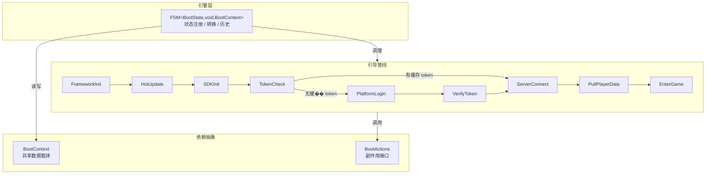
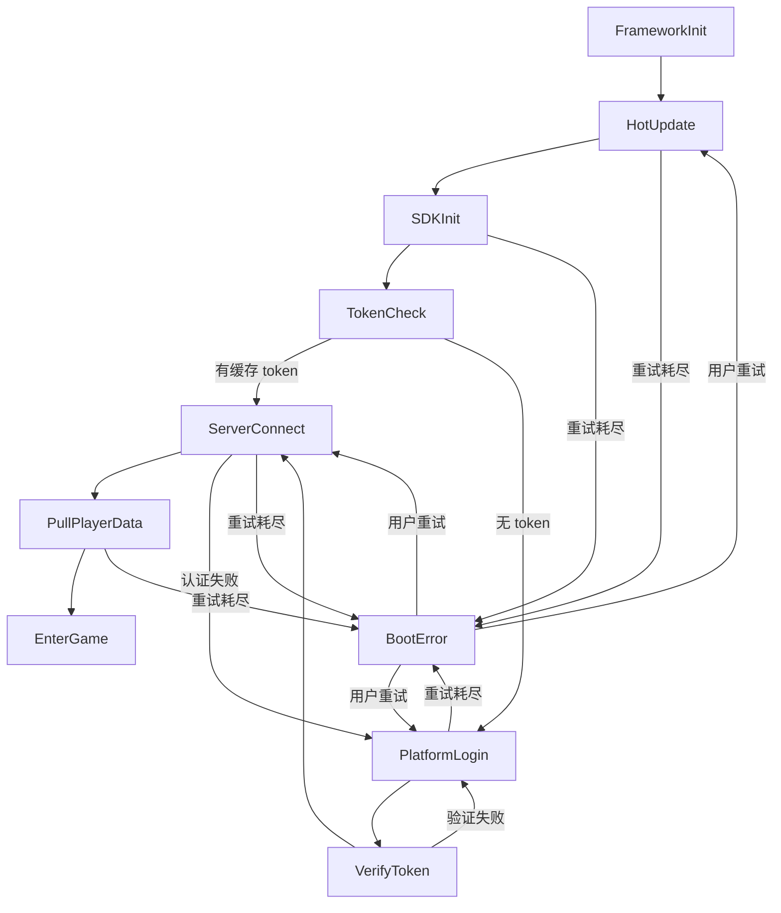

## 背景

年初线上事故：iOS 审核包的热更新检查超时 30 秒，随后 SDK 初始化直接崩了。排查时发现启动逻辑散落在一个 400 行的 `startup()` 函数里——12 层 `try/catch` 嵌套，`retryCount` 变量在五处被修改，某个失败路径会跳过 token 写入直接进游戏。

这个经历促使我们把整个启动流程拆开、摊平，用有限状态机重新表达。每个步骤是独立的 `IState` 实现，所有可能的状态转换——包括错误和回退——画在一张图上。不认识这个项目的人，看这张图就知道启动会发生什么。

## 整体架构

boot 模块分三层：**FSM 引擎**（泛型类，纯调度）、**引导管线**（10 个状态，每个是单一职责的类）、**依赖抽象**（Context 存数据，Actions 定义副作用）。



启动路径不止一条。完整的转换图包含 10 个节点和 17 条边——其中 7 条是错误/回退路径：



这张图就是启动流程的完整文档。新人不需要从分散的 `if/else` 中推导——直接看图就能理解"什么情况会走到哪里"。

## 核心设计

### 1. IState 的三步协议

FSM 引擎完全泛型化，不依赖任何业务细节。它只知道每个状态遵循三步协议：

```typescript
// utils/fsm/IState.ts
export interface IState<TState, TEvent, TContext> {
    name: TState;
    onEnter?(context: TContext, prevState: TState): void;
    onExit?(context: TContext, nextState: TState): void;
    handleEvent?(event: TEvent, context: TContext): TState | null;
}
```

FSM 的 `transitionTo` 严格遵守 **退出 → 进入** 的顺序：

```typescript
// utils/fsm/FSM.ts — transitionTo 核心逻辑
public transitionTo(targetState: TState, event: TEvent): boolean {
    const target = this.states.get(targetState);
    if (!target) return false;

    this.currentState.onExit?.(this.context, targetState);  // 先退出
    const prevState = this.currentState.name;
    target.onEnter?.(this.context, prevState);               // 再进入
    this.currentState = target;
    return true;
}
```

这个顺序保证了 `onExit` 对称清理，事件监听不会泄漏。每个异步状态都依赖它——在 `onExit` 中注销 `onEnter` 注册的所有监听。

`BootFSM` 本身只有构造逻辑——指定初始状态、注入 Context、注册 10 个状态：

```typescript
// boot/BootFSM.ts
export class BootFSM extends FSM<BootState, void, BootContext> {
    constructor(ctx: BootContext) {
        super({ initialState: BootState.FrameworkInit }, ctx);
        ctx.fsm = this;
        this.registerStates([
            new FrameworkInitState(),
            new HotUpdateState(),
            // ... 其余 8 个状态
        ]);
    }
}
```

### 2. 异步状态模板：onEnter 触发 → 事件回调 → transitionTo

7 个状态是异步的——它们触发一个操作，然后等待全局事件回调。以 `HotUpdateState` 为例，这构成了一个可复用的模板：

```typescript
// impl/HotUpdateState.ts
export class HotUpdateState implements IState<BootState, void, BootContext> {
    readonly name = BootState.HotUpdate;
    private _ctx!: BootContext;

    onEnter(ctx: BootContext): void {
        this._ctx = ctx;
        M.event.once(CoreEvents.HOT_UPDATE_READY, this.onReady, this);
        M.event.once(CoreEvents.HOT_UPDATE_FAILED, this.onFailed, this);
        M.hotupdate.checkUpdate();   // 触发异步操作
    }

    onExit(): void {
        M.event.off(CoreEvents.HOT_UPDATE_READY, this.onReady, this);
        M.event.off(CoreEvents.HOT_UPDATE_FAILED, this.onFailed, this);
        this._ctx = null!;
    }

    private onReady = (): void => {
        this._ctx.fsm.transitionTo(BootState.SDKInit, undefined!);
    };

    private onFailed = (data: { error: string }): void => {
        if (this._ctx.incrementRetry(BootState.HotUpdate)) {
            this._ctx.fsm.transitionTo(BootState.HotUpdate, undefined!);  // 重试
        } else {
            this._ctx.lastFailedState = BootState.HotUpdate;
            this._ctx.lastError = { code: 'HOT_UPDATE_FAILED', msg: data.error };
            this._ctx.fsm.transitionTo(BootState.BootError, undefined!);   // 放弃
        }
    };
}
```

这个模板有三层保障：

- **`once` 而非 `on`**：事件回调只执行一次，不会在重试时重复触发
- **`onExit` 对称注销**：即使 `transitionTo` 被提前调用，残留监听也被清理
- **重试内聚在每个状态内**：`incrementRetry` 按状态名独立计数，一个步骤的重试不影响其他步骤

同步状态如 `TokenCheckState` 更简单——没有 `_ctx`、没有事件、没有 `onExit`，只有纯逻辑判断。

### 3. 条件分支与回退：图上可读的跳转

状态机的核心价值不在于正常路径——正常路径 `async/await` 也能写。**价值在于失败路径和回退路径被显式画在图上。**

**TokenCheck 的分支**：根据本地是否有缓存 token，决定跳过登录还是进入登录：

```typescript
// impl/TokenCheckState.ts
onEnter(ctx: BootContext): void {
    const token = ctx.actions.getCachedToken();
    if (token) {
        ctx.cachedToken = token;
        ctx.fsm.transitionTo(BootState.ServerConnect, undefined!);  // 免登
    } else {
        ctx.fsm.transitionTo(BootState.PlatformLogin, undefined!);  // 需要登录
    }
}
```

**ServerConnect 的认证失败回退**：服务器连接断开后，根据错误码决定是重试还是回退到登录：

```typescript
// impl/ServerConnectState.ts — onDisconnected 处理
private onDisconnected = (data: { reason: string; code?: number }): void => {
    if (data.code === NetErrorCode.AUTH_FAILED) {
        ctx.actions.clearCachedToken();
        ctx.fsm.transitionTo(BootState.PlatformLogin, undefined!);  // 回退登录
        return;
    }
    // 普通断连：重试或进入错误状态
};
```

**PlatformLogin 的取消语义**：用户关掉登录面板不算失败，只重新绑定监听：

```typescript
// impl/PlatformLoginState.ts — 取消不算失败
private onLoginFailed = (data: { error: string; canceled?: boolean }): void => {
    if (data.canceled) {
        this.bindListeners();   // 只重新绑定，不增加重试计数
        return;
    }
    // 真正的失败：增加重试计数
};
```

这三段逻辑如果写在一个大函数里，需要用标志位和深层 `if/else` 区分。在状态机中，每种跳转都对应图上的一条边，清晰可追踪。

### 4. BootContext + BootActions：关注点分离

启动流程需要的共享状态和外部能力被拆成两个独立对象：

```typescript
// boot/BootContext.ts — 纯数据载体，不触发副作用
export class BootContext {
    fsm!: FSM<BootState, void, BootContext>;
    readonly actions: BootActions;

    sdkLoginResult?: unknown;
    cachedToken?: string;
    serverToken?: string;

    retryCount: Map<string, number> = new Map();   // 按状态隔离计数
    maxRetry = 3;

    lastError?: BootErrorInfo;
    lastFailedState?: BootState;                    // 错误态用此决定回退目标

    incrementRetry(state: string): boolean {
        const count = (this.retryCount.get(state) ?? 0) + 1;
        this.retryCount.set(state, count);
        return count <= this.maxRetry;
    }
}
```

```typescript
// base/BootActions.ts — 副作用接口，业务层实现
export interface BootActions {
    startupFramework(): void;
    openLoginUI(): void;
    openErrorUI(data: { error: BootErrorInfo; onRetry: () => void }): void;
    openStartupGameUI(): void;
    getCachedToken(): string | null;
    clearCachedToken(): void;
    verifyToken(credential: unknown): void;
    pullPlayerData(): void;
}
```

`lastFailedState` 是一个重要的设计细节。`BootErrorState` 用它来决定用户点"重试"后跳回哪里——不硬编码目标状态名。这意味着新增一个可失败步骤时，不需要修改 `BootErrorState`：

```typescript
// impl/BootErrorState.ts
onEnter(ctx: BootContext): void {
    ctx.actions.openErrorUI({
        error: ctx.lastError!,
        onRetry: () => {
            const target = ctx.lastFailedState!;
            ctx.resetRetry(target);
            ctx.fsm.transitionTo(target, undefined!);
        },
    });
}
```

## 设计取舍

**为什么不用 async/await？**

大部分步骤确实是"发起请求 → 等待结果 → 下一步"，天然适合 `await`。但在 Cocos Creator 环境中：

- SDK 回调（如平台登录）不返回 Promise。`promisify` 意味着像 `M.event.once` 包一层，只是把事件监听换成 `resolve/reject`，没有解决根本问题
- 重试逻辑在 async/await 中需要包装成 `retry(fn, maxRetries)`，但不同步骤的错误处理不同——有的重试自己，有的回退登录，有的进入错误界面。通用 `retry()` 反而会掩盖差异
- 每个状态的可测试性：`new HotUpdateState().onEnter(mockContext)` 然后断言 `ctx.fsm.transitionTo` 被调用时的目标状态——比测试一个 400 行的 `async function` 简单得多

**文件数 vs 可维护性**

10 个状态 = 10 个文件，初看比一个函数繁琐。但其中 7 个异步状态遵循完全相同的模板：改三处（事件名、成功目标、失败目标），不会影响其他逻辑。新增一个步骤不会破坏已有步骤。

**为什么单独定义 BootActions 接口**

Context 是数据，Actions 是副作用。分离后，测试时只需 mock `BootActions`，Context 直接用真实实例——不需要 mock 整个 Context。

## 总结

用 FSM 管理游戏启动流程的核心价值：

- **状态图即文档**：所有路径（包括 7 条错误/回退边）在一张图中可见
- **单步可测**：任何状态可以独立构造 Context 并断言转换目标
- **新增步骤零风险**：加一个状态类 + 在 `BootFSM` 注册，不动现有代码
- **引擎可复用**：`FSM<TState, TEvent, TContext>` 是泛型的，同一套代码也驱动 UI 栈和网络状态机

如果你面对类似的启动流程——多异步步骤、可失败可重试、有回退路径——试试把它画成状态图。一旦画出来，代码结构也就出来了。
